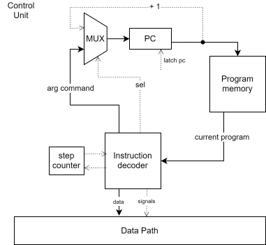

# Лабораторная работа №3. Отчёт

Кузенина Валерия Николаевна, P3232

`alg | acc | harv | hw | tick | struct | stream | port | pstr | prob1 |`

Базовый вариант (без усложнения)
## Синтаксис
``` ebnf
<program> ::= { <statement> }

<statement> ::= "if" <cond-expr> <statement> |
                "if" <cond-expr> <statement> "else" <statement> |
                "while" <cond-expr> <statement> |
                "{" { <statement> } "}" |
                <expr> ";" |
                <input-expr> ";" |
                <output-expr> ";" |
                <declaration> |
                <variable_assignment> |
                ";"

<declaration> ::= type <id> "=" <expr>

<variable_assignment> ::= <id> "=" <expr>

<cond-expr> ::= "(" <expr> ( "==" | "<" | ">" ) <expr> ")"

<type> ::= "int" | "string"

<input-expr> ::= "input" "(" <id> ")" |  "input_char" "(" <id> ")"

<output-expr> ::= "print" ( <id> | <string> ) | "print_char" ( <id> | <letter> )

<expr> ::= <id> |
           <digit> |
           <string> |
           <expr> "%" <expr> |
           <expr> "+" <expr> |
           <expr> "-" <expr>

<id> ::= <letter>

<string> ::= <letter> | <string> <letter>

<letter> ::= [a-zA-Z]

<digit> ::= "0" | "1" | ... | "9"
```
### Особенности
- У переменных глобальная область видимости
- Статическая типизация
- Поддерживаемые типы: `string`, `int`
- 
## Модель процессора




## Набор инструкций

| Opcode | ARG   | Кол-во тактов | Описание                                                    |
|:-----|:----    |:--------------|:------------------------------------------------------------|
| ST   | +   | 2                 | сохранить значение в указанной ячейке из acc                  |
| LD   | +   | 2                 | загрузить значение в acc                   |
| CMP  | +   | 1               | установить флаги z и n по операции acc - arg                           |
| HLT  | -   | 0               | остановка                                |
| ADD  | +   | 2               | сложить значение из аккумулятора со значением, переданным в аргументе          |
| SUB  | +   | 2               | вычесть из аккумулятора значение, переданное в аргументе |
| DIV  | +`  | 1               | посчитать модуль числа от деления аккумулятора на значение, переданное в аргументе                                     |
| OUT  | -   | 2               | вывести значение из аккумулятора на устройство вывода                          |
|  IN  | -   | 0               | ввести значение в аккумулятор с устройства ввода                                                  |
|  JNZ | +   | 0               | переход если флаг z не установлен                                                  |
|  JZ  | +   | 0               | переход если флаг z установлен                                                  |
|  JN  | +   | 0               | переход если флаг n установлен                                                  |
|  JLE | +   | 0               | переход если флаг z установлен или n установлен (переход если меньше либо равно)                                                 |
|  JGE | +   | 0               | переход если флаг z установлен или n не установлен (переход если больше либо равно)                                                 |
|  JMP | +   | 1               | безусловный переход                                         |

Реализовано 3 вида адресации операнда:
- IMMEDIATE -  аргумент содержит данные. 
- DIRECT - операнд указывает на ячейку памяти, содержащую данные. 
- INDIRECT - операнд содержит адрес памяти, по которому находится фактический адрес данных.


